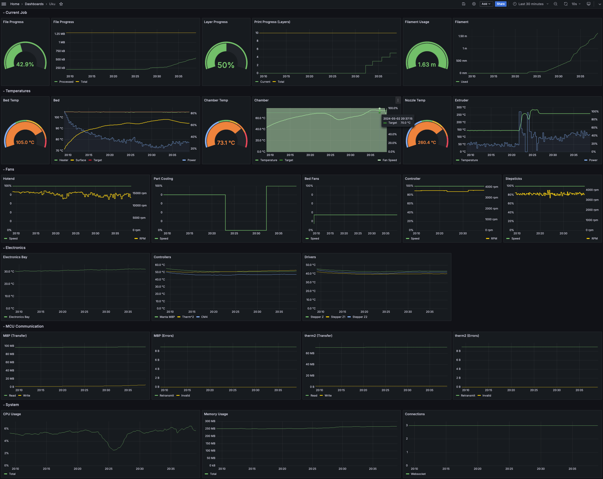

# Mamalluca

Mamalluca is a Prometheus exporter for Klipper and Moonraker to instrument and capture metrics for your 3D printer.

Each Mamalluca instance will monitor a single Moonraker instance and export metrics on a dedicated HTTP listener.
Mamalluca does not need to run on the same host as Moonraker as long as it can establish a Websocket connection to the Moonraker instance.

Mamalluca provides a Prometheus scrape target over HTTP on a configurable port.

## Example Dashboard



## Installation

Download the latest version for your platform from [GitHub Releases](github.com/mjonuschat/mamalluca/releases/latest). Precompiled binaries are provides for the following operating systems and CPU architectures:

- aarch64-linux
- x86_64-linux
- aarch64-macos
- x86_64-macos
- x86_64-windows

### Download & Install

```bash
mkdir -p $HOME/mamalluca
cd $HOME/mamalluca
wget https://github.com/mjonuschat/mamalluca/releases/latest/download/mamalluca-aarch64-linux
chmod a+x mamalluca-aarch64-linux
mv mamalluca-aarch64-linux mamalluca
```

### Verify connectivity

The following command will start the exporter and try to connect to the Moonraker instance on the local host.
If the command is successfull you should start seeing messages about status updates being processed.

```bash
./mamalluca -vv
```

**Example output**
```text
2024-04-30T02:11:44.149790Z  INFO ezsockets::client: connecting to ws://127.0.0.1:7125/websocket...
2024-04-30T02:11:44.149915Z  INFO ezsockets::client: connecting attempt no: 1...
2024-04-30T02:11:49.403001Z DEBUG tungstenite::handshake::client: Client handshake done.
2024-04-30T02:11:49.403278Z  INFO ezsockets::client: successfully connected
2024-04-30T02:11:49.403567Z  INFO ezsockets::client: connected to ws://127.0.0.1:7125/websocket
2024-04-30T02:11:49.403832Z  INFO mamalluca::moonraker::handler: Connected to Moonraker url="ws://127.0.0.1:7125/websocket"
2024-04-30T02:11:49.573639Z DEBUG mamalluca::moonraker::handler: Processing status update key="controller_fan controller_fan"
...
```

**Checking metrics exporter**

By default the metrics exporter listens on all interfaces of the computer on port `9000`. Assuming your printer is reachable with the name `printer.local` you can open [http://printer.local:9000/](http://printer.local:9000/) and see the metrics that are being exported so far.

### Running the exporter in the background

Use the following instructions to create and enable a systemd unit file to start Mamalluca. Make sure to adjust the paths and usernames as needed if your user is not named `pi`.

```bash
cd $HOME/mamalluca
nano $HOME/mamalluca/mamalluca.service
sudo systemctl link mamalluca/mamalluca.service
sudo systemctl enable mamalluca
sudo systemctl start mamalluca
```

**mamalluca.service**
```text
[Unit]
Description=Moonraker/Klipper Prometheus Exporter
Documentation=https://github.com/mjonuschat/mamalluca
After=moonraker.service

[Install]
WantedBy=multi-user.target

[Service]
Type=simple
User=pi
RemainAfterExit=no
WorkingDirectory=/home/pi/mamalluca
ExecStart=/home/pi/mamalluca/mamalluca -v
Restart=always
RestartSec=10
MemoryAccounting=on
MemoryMax=256M
```

**Verifying Mamalluca is running**

The following command should show that the service is active and running:

```bash
systemctl status mamalluca
```

```text
● mamalluca.service - Moonraker/Klipper Prometheus Exporter
     Loaded: loaded (/etc/systemd/system/mamalluca.service; enabled; preset: enabled)
     Active: active (running) since Wed 2024-05-01 19:10:07 PDT; 1s ago
     ...
```
## Contributing

Contributions are always welcome! Take a look at the open [issues](https://github.com/mjonuschat/mamalluca/issues) for ideas of where to get started or open a pull request with your bugfix/feature/enhancement.


## Authors

- [@mjonuschat](https://www.github.com/mjonuschat)


## License

[GNU General Public License v3.0](https://choosealicense.com/licenses/gpl-3.0/)
