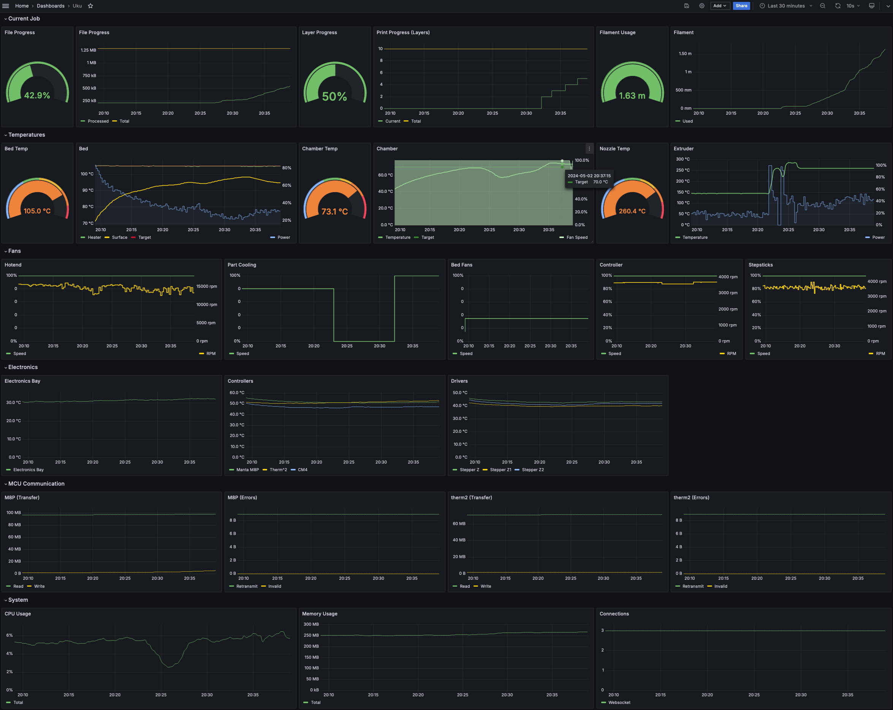

# Mamalluca

Mamalluca is a Prometheus exporter for Klipper and Moonraker to instrument and capture metrics for your 3D printer.

Each Mamalluca instance will monitor a single Moonraker instance and export metrics on a dedicated HTTP listener.
Mamalluca does not need to run on the same host as Moonraker as long as it can establish a Websocket connection to the Moonraker instance.

Mamalluca provides a Prometheus scrape target over HTTP on a configurable port.

### Endpoints

- `/` and `/metrics` — Prometheus text format metrics
- `/health` — JSON health check with Moonraker connection status (200 OK / 503 Service Unavailable)

## Example Dashboard



## Installation

Download the latest version for your platform from [GitHub Releases](https://github.com/mjonuschat/mamalluca/releases/latest). Precompiled binaries are provided for the following operating systems and CPU architectures:

- aarch64-linux
- x86_64-linux
- aarch64-macos
- x86_64-macos
- x86_64-windows

### Download & Install

```bash
mkdir -p $HOME/mamalluca
cd $HOME/mamalluca
wget https://github.com/mjonuschat/mamalluca/releases/latest/download/mamalluca-aarch64-linux
chmod a+x mamalluca-aarch64-linux
mv mamalluca-aarch64-linux mamalluca
```

### Verify connectivity

The following command will start the exporter and try to connect to the Moonraker instance on the local host.
If the command is successful you should start seeing messages about status updates being processed.

```bash
./mamalluca -vv
```

**Example output**
```text
2026-03-28T17:49:33.442030Z  INFO mamalluca::metrics::registry: Built collector registry singletons=14 named=19
2026-03-28T17:49:33.442462Z  INFO moonraker_client::reconnect: Connecting to Moonraker url=ws://127.0.0.1:7125/websocket
2026-03-28T17:49:33.442729Z  INFO mamalluca: HTTP server listening address=0.0.0.0:9000
2026-03-28T17:49:33.452611Z DEBUG tungstenite::handshake::client: Client handshake done.
2026-03-28T17:49:33.452675Z  INFO moonraker_client::reconnect: Connected to Moonraker
2026-03-28T17:49:33.452688Z  INFO mamalluca: Connected to Moonraker
...
```

**Checking metrics exporter**

By default the metrics exporter listens on all interfaces of the computer on port `9000`. Assuming your printer is reachable with the name `printer.local` you can open [http://printer.local:9000/metrics](http://printer.local:9000/metrics) to see the exported metrics, or [http://printer.local:9000/health](http://printer.local:9000/health) to check the connection status.

### Running the exporter in the background

Use the following instructions to create and enable a systemd unit file to start Mamalluca. Make sure to adjust the paths and usernames as needed if your user is not named `pi`.

```bash
cd $HOME/mamalluca
nano $HOME/mamalluca/mamalluca.service
sudo systemctl link mamalluca/mamalluca.service
sudo systemctl enable mamalluca
sudo systemctl start mamalluca
```

**mamalluca.service**
```text
[Unit]
Description=Moonraker/Klipper Prometheus Exporter
Documentation=https://github.com/mjonuschat/mamalluca
After=moonraker.service

[Install]
WantedBy=multi-user.target

[Service]
Type=simple
User=pi
RemainAfterExit=no
WorkingDirectory=/home/pi/mamalluca
ExecStart=/home/pi/mamalluca/mamalluca -v
Restart=always
RestartSec=10
MemoryAccounting=on
MemoryMax=256M
```

**Verifying Mamalluca is running**

The following command should show that the service is active and running:

```bash
systemctl status mamalluca
```

```text
● mamalluca.service - Moonraker/Klipper Prometheus Exporter
     Loaded: loaded (/etc/systemd/system/mamalluca.service; enabled; preset: enabled)
     Active: active (running) since Wed 2024-05-01 19:10:07 PDT; 1s ago
     ...
```
### Docker

A Dockerfile is provided for containerized deployments:

```bash
docker build -t mamalluca .
docker run -p 9000:9000 mamalluca -m ws://your-printer:7125/websocket
```

Or with docker-compose alongside Prometheus and Grafana:

```yaml
services:
  mamalluca:
    build: .
    ports:
      - "9000:9000"
    command: ["-m", "ws://moonraker:7125/websocket"]
    restart: unless-stopped
    healthcheck:
      test: ["CMD", "wget", "-q", "--spider", "http://localhost:9000/health"]
      interval: 30s
      timeout: 5s
      retries: 3
```

## Contributing

Contributions are always welcome! Take a look at the open [issues](https://github.com/mjonuschat/mamalluca/issues) for ideas of where to get started or open a pull request with your bugfix/feature/enhancement.


## Authors

- [@mjonuschat](https://www.github.com/mjonuschat)


## License

The mamalluca binary is licensed under the [GNU General Public License v3.0](https://choosealicense.com/licenses/gpl-3.0/).

The library crates (`klipper-types`, `moonraker-types`, `moonraker-client`, `mamalluca-macros`) are dual-licensed under [MIT](LICENSE-MIT) or [Apache-2.0](LICENSE-APACHE).
